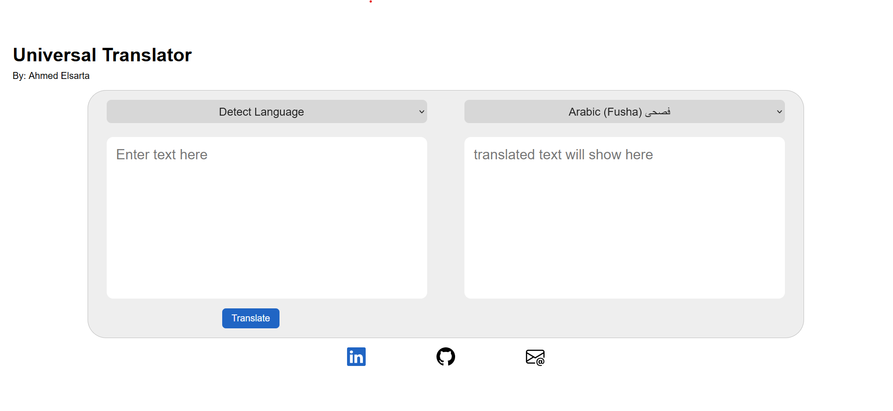

# Dialect translator project using  API (poe api)
 

table of contents
- [Dialect translator project using  API (poe api)](#dialect-translator-project-using--api-poe-api)
  - [Project description](#project-description)
  - [Demo Video](#demo-video)
  - [How to use  ](#how-to-use--)
  - [future work](#future-work)

## Project description
This project is a simple one-page web app that utilizes the incredible ability of current llms to interpret and translate text into not only formal language, but informal one too. In the project you can choose from the available options or even enter your own options via a custom element.

## Demo Video

https://github.com/ahmed-elsarta/universal-translator-project/assets/89668727/fe7f6a8e-8f53-40be-a3f9-c911ab789da0

## How to use 
1. use the following command to download the required packages (make sure to navigate to the project directory) \
   `pip install -r requirements.txt`
2. Get your poe api key, refer to the [api documentation](https://github.com/ading2210/poe-api) for help
3. Open up the `tranlation.py` folder using a text editor and add the api key to line 5, it should look something like this, with your token instead of the random letters. \
   `token = "ldkfjskdfjbahbdfjabdfjkbhaf"`
4. run the `app.py` file using one of the following commands.  \
   `python app.py`
   `python3 app.py` \
(also make sure to have an active internet connection in order for the api to work) 
5. on your browser (preferably firefox) navigate to the following url [127.0.0.1:5000/](127.0.0.1:5000/) \
   Note: if you want to use a different url you can change the host and port from the `app.py` file.

## future work
1. Instead of using an indirect method (poe api), it's best to use openAi's own framework, but when I tried it, it had worse results compared to poe.
2. Audio transciption, why not.
3. Update the Ui to be more futurustic.
